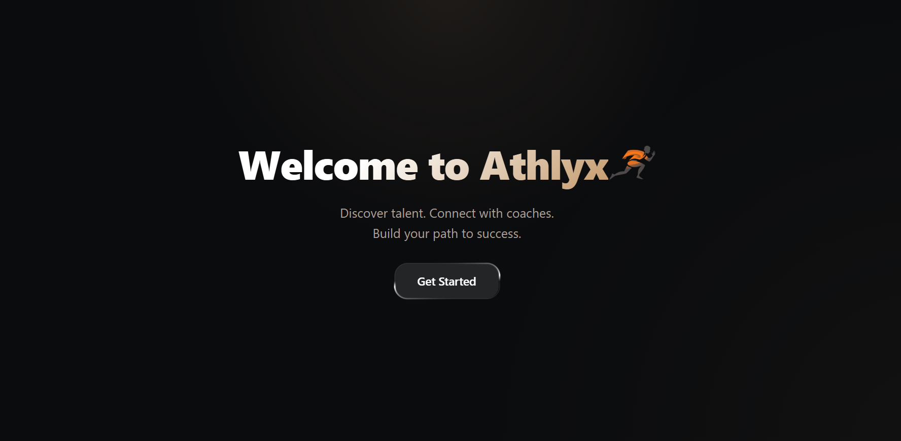
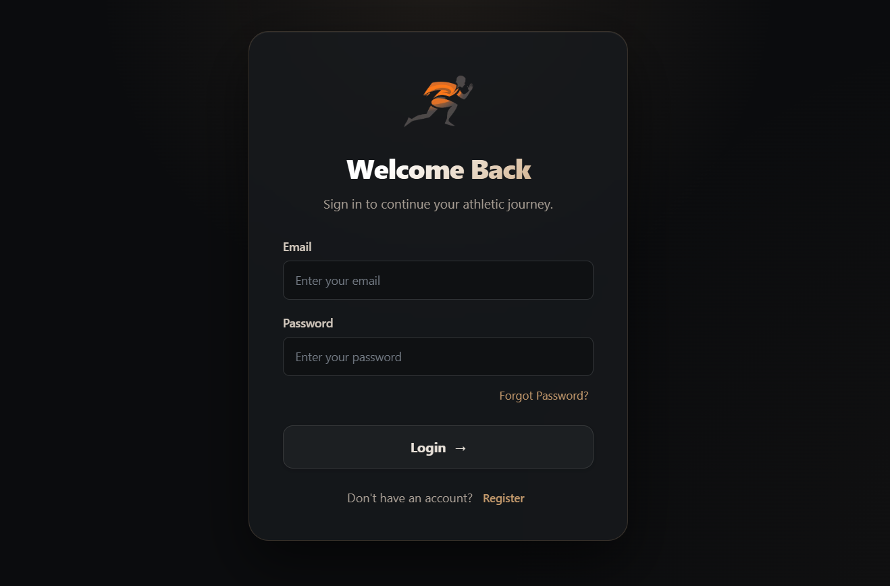
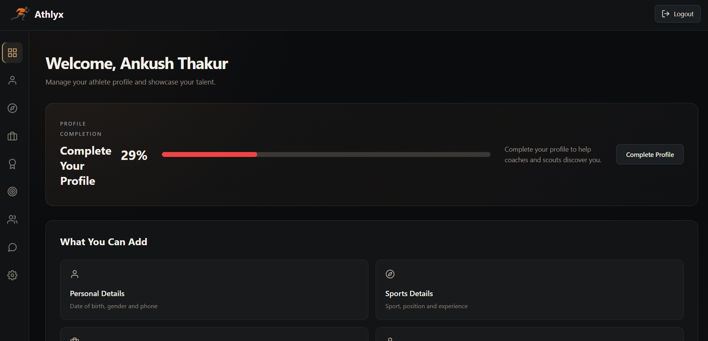
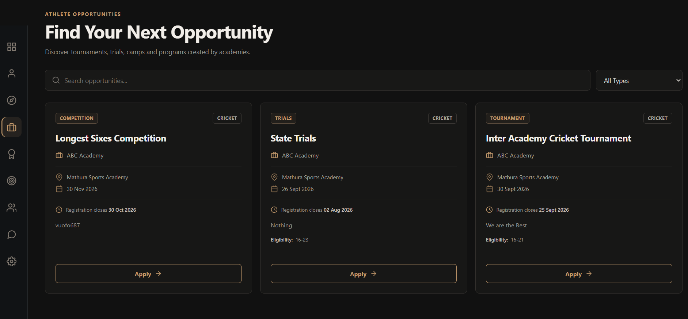
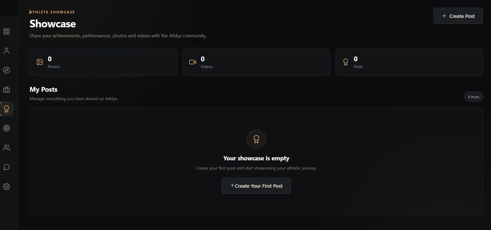
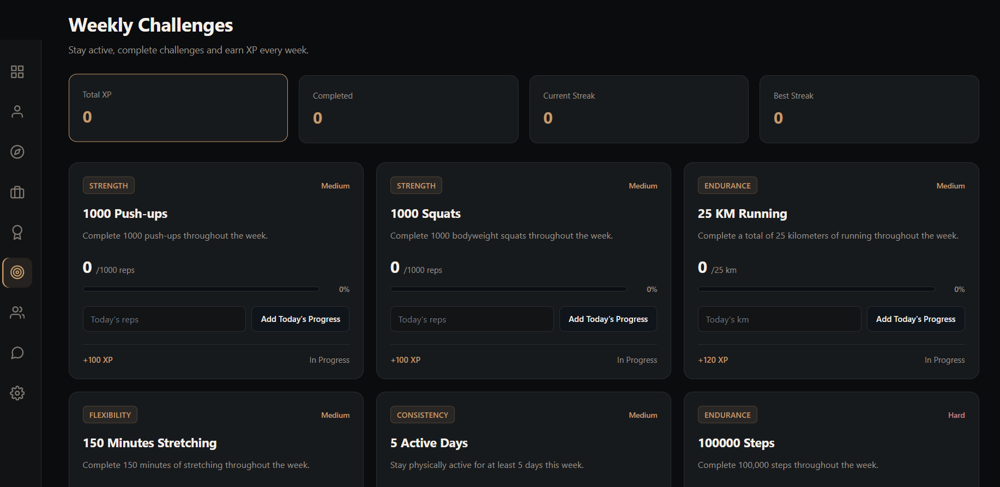
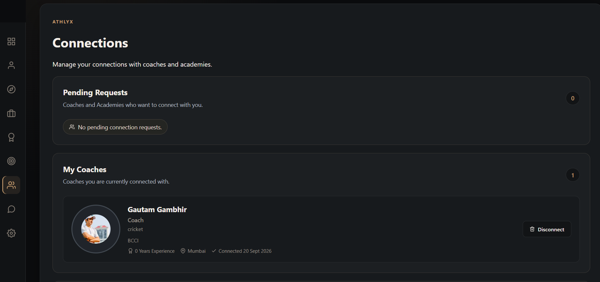
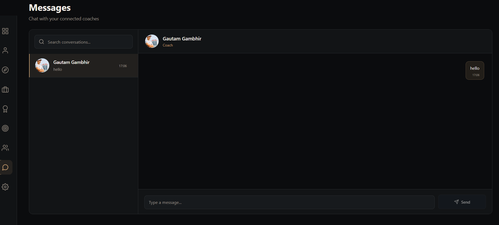
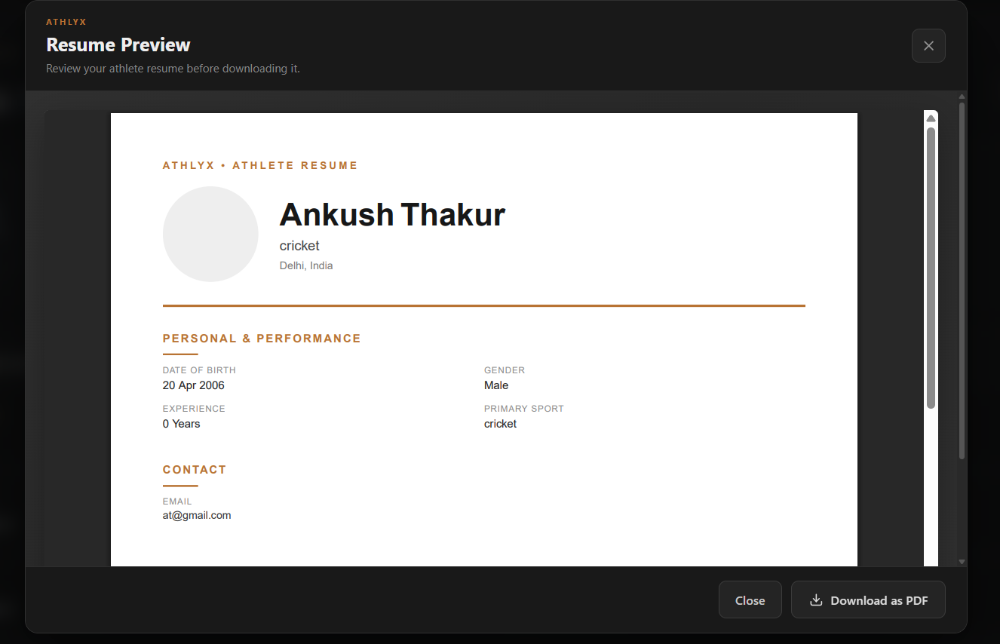
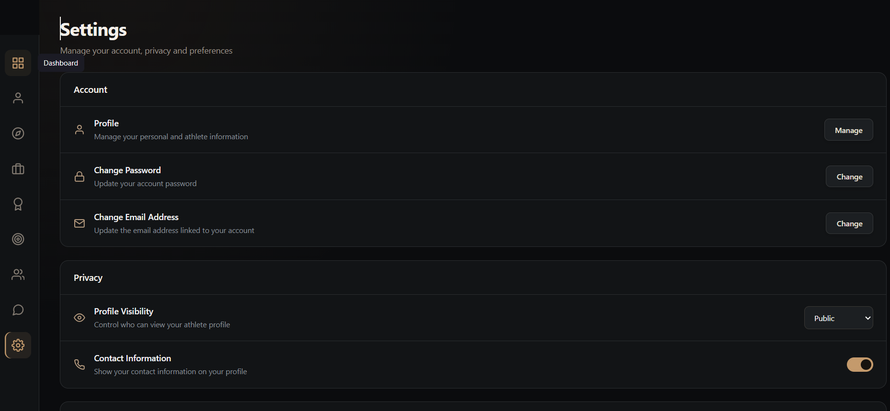

# ATHLYX | Local Talent. Big Opportunities. 🏆

### A Sports Networking & Talent Discovery Platform

**Athlyx** is a web-based sports networking platform that bridges the gap between athletes, coaches, and sports academies. It empowers athletes to showcase their talent, discover opportunities, and build meaningful connections while enabling coaches and academies to discover emerging sporting talent.

> **Our vision:** Every athlete deserves the opportunity to be discovered.

---

## 💡 The Problem

Sports talent is everywhere, but opportunities to get discovered are not equally accessible.

* **Athletes** often lack a centralized platform to showcase their skills, achievements, and sporting journey.
* **Coaches** face challenges discovering athletes beyond their existing networks.
* **Sports academies** need accessible ways to discover athletes and present their training programs.
* **Talent discovery and networking** can remain fragmented across social media, personal contacts, and local communities.

---

## 🚀 Our Solution

Athlyx brings athletes, coaches, and academies together through a unified sports networking platform.

It provides athletes with a digital presence to showcase their achievements, discover opportunities, build connections, and communicate with their sporting network.

Instead of limiting an athlete's visibility to their immediate network, Athlyx creates a dedicated space for **sports talent discovery and professional networking**.

---

# 📸 Product Showcase

The screenshots below follow the **Athlyx user journey**, from entering the platform to discovering opportunities, showcasing talent, networking, communicating, and managing the account.

---

### 1. Landing Page

The starting point of Athlyx introduces the platform, its purpose, and its vision.



---

### 2. Authentication

Users can register or log in to access their role-based Athlyx experience.



---

### 3. Athlete Dashboard

The dashboard acts as the central workspace, giving athletes access to the platform's major features.



---

### 4. Discover Opportunities

Athletes can explore sporting opportunities through a dedicated opportunities section.



---

### 5. Showcase Your Talent

Athletes can showcase their sporting journey, achievements, and content through the showcase feature.



---

### 6. Weekly Sports Challenges

Weekly challenges help athletes stay engaged and participate in sports-focused activities.



---

### 7. Build Your Network

Athletes and coaches can create professional sporting connections through connection requests.



---

### 8. Connect & Communicate

Connected users can communicate through Athlyx's integrated messaging experience.



---

### 9. Professional Sports Resume

Athlete profile information can be presented as a structured professional resume.



---

### 10. Account Settings

Users can manage their account and profile-related settings.



---

# ✨ Key Features

## 🏃 Athlete-Centric Profiles

Create a personalized sporting identity containing:

* Sport and position
* Experience
* Skills
* Achievements
* Bio
* Physical information
* Social links
* Availability

## 🔍 Talent Discovery

Discover athletes and explore their sporting profiles through dedicated discovery experiences.

## 💼 Opportunities

Explore sporting opportunities through a centralized opportunities interface.

## 🖼️ Talent Showcase

Present achievements and the sporting journey through dedicated showcase posts.

## 🎯 Weekly Challenges

Participate in weekly sports challenges to stay active and engaged.

## 🤝 Sports Networking

* Send connection requests
* Receive connection requests
* Accept or reject requests
* Manage accepted connections

## 💬 Connected Messaging

* View conversations
* Exchange messages
* Track unread messages
* Communicate with connected users

## 🏫 Academy Profiles

Academies can create profiles containing:

* Academy information
* Sport and specialization
* Training programs
* Facilities
* Achievements
* Location
* Contact information

## 👥 Role-Based Experience

Athlyx is designed around different participants in the sports ecosystem:

| Role        | Platform Experience                                       |
| ----------- | --------------------------------------------------------- |
| 🏃 Athlete  | Profile, showcase, opportunities, connections, challenges |
| 🧑‍🏫 Coach | Profile, athlete discovery, connections, messaging        |
| 🏫 Academy  | Academy profile and athlete discovery                     |
| 🔎 Scout    | Talent discovery                                          |
| 🛠️ Admin   | Platform-level management                                 |

---

# 🌟 What Makes Athlyx Different?

Athlyx is designed around the **sports talent ecosystem** rather than general-purpose professional networking.

### Athlete-First

Sporting skills, achievements, experience, and opportunities are at the center of the platform.

### Connected Ecosystem

Athletes, coaches, and academies can interact within one focused platform.

### Discovery-Focused

Dedicated discovery experiences help users explore sporting talent.

### Networking Beyond the Field

Connection requests and messaging support ongoing communication between users.

### Engagement

Weekly challenges provide athletes with additional ways to stay active on the platform.

---

# 🛠️ Technology Stack

Athlyx is built using the **MERN stack** with additional technologies for authentication, image management, and frontend development.

| Technology       | Purpose                                |
| ---------------- | -------------------------------------- |
| **MongoDB**      | Database                               |
| **Express.js**   | Backend API framework                  |
| **React.js**     | Frontend interface                     |
| **Node.js**      | Backend runtime                        |
| **Vite**         | Frontend development and build tooling |
| **Mongoose**     | MongoDB object modeling                |
| **Axios**        | Client-server communication            |
| **React Router** | Client-side navigation                 |
| **JWT**          | Authentication                         |
| **ImageKit**     | Image storage and delivery             |
| **React Icons**  | UI icons                               |

---

# 🏗️ System Architecture

Athlyx follows a client-server architecture, with the React frontend communicating with the Node.js and Express backend through REST APIs.

```text
                         ATHLYX
                           │
                           ▼
                 ┌──────────────────┐
                 │  React + Vite    │
                 │    Frontend      │
                 └────────┬─────────┘
                          │
                       Axios
                          │
                          ▼
                 ┌──────────────────┐
                 │ Node + Express   │
                 │    REST APIs     │
                 └────────┬─────────┘
                          │
              ┌───────────┼───────────┐
              ▼           ▼           ▼
          MongoDB      JWT Auth    ImageKit
              │
              ▼
       User & Sports Data
```

---

# 📂 Project Structure

```text
Athlyx/
│
├── backend/
│   ├── src/
│   │   ├── config/
│   │   ├── controllers/
│   │   ├── middleware/
│   │   ├── models/
│   │   ├── routes/
│   │   └── seeds/
│   ├── server.js
│   └── package.json
│
├── frontend/
│   ├── src/
│   │   ├── components/
│   │   ├── pages/
│   │   ├── assets/
│   │   ├── App.jsx
│   │   └── index.css
│   └── package.json
│
├── ScreenShots/
│   ├── Auth.png
│   ├── Challenges.png
│   ├── Chats.png
│   ├── Connections.png
│   ├── DashBoard.png
│   ├── Home.png
│   ├── Landing.png
│   ├── Opportunity.png
│   ├── Resume.png
│   ├── Settings.png
│   └── ShowCase.png
│
└── README.md
```

---

# 🔗 Backend API Modules

Athlyx is organized into modular REST APIs:

| Route              | Description                    |
| ------------------ | ------------------------------ |
| `/api/auth`        | Authentication                 |
| `/api/users`       | User management                |
| `/api/athletes`    | Athlete profiles and discovery |
| `/api/coaches`     | Coach profiles                 |
| `/api/academies`   | Academy profiles               |
| `/api/connections` | Connection management          |
| `/api/chat`        | Messaging                      |
| `/api/showcase`    | Athlete showcase               |
| `/api/challenges`  | Weekly challenges              |

---

# ⚙️ Installation & Setup

## Prerequisites

* Node.js
* npm
* MongoDB or MongoDB Atlas
* Git

### 1. Clone the Repository

```bash
git clone <YOUR_GITHUB_REPOSITORY_URL>
cd Athlyx
```

### 2. Set Up the Backend

```bash
cd backend
npm install
```

Create a `.env` file inside the `backend` directory:

```env
PORT=5000
MONGO_URI=your_mongodb_connection_string
JWT_SECRET=your_jwt_secret
```

Add the required ImageKit environment variables for image functionality.

Start the backend:

```bash
npm run dev
```

Backend:

```text
http://localhost:5000
```

### 3. Set Up the Frontend

Open a new terminal:

```bash
cd frontend
npm install
npm run dev
```

Frontend:

```text
http://localhost:5173
```

---

# 🔐 Authentication & Security

Athlyx uses authentication and role-based authorization to provide different experiences for different platform participants.

Key concepts include:

* JWT-based authentication
* Protected API routes
* Role-based access control
* User-specific profile management
* Connection-based communication

---

# 🔮 Future Roadmap

Athlyx has the potential to evolve into a broader digital ecosystem for sports talent development.

### 🤖 AI-Assisted Talent Discovery

Explore intelligent matching based on athlete profiles, skills, sport, position, experience, and other relevant information.

### ✅ Verified Athlete Profiles

Introduce mechanisms to verify sporting achievements and credentials.

### 🏟️ Events & Trials

Add tournaments, trials, competitions, and sports events.

### 🔔 Notifications

Introduce notifications for:

* Connection requests
* Messages
* Opportunities
* Challenges

### 🌐 Expanded Sports Ecosystem

Connect athletes with more coaches, academies, scouts, organizations, and sporting opportunities.

---

# 🎯 Hackathon Project Summary

| Category         | Details                                |
| ---------------- | -------------------------------------- |
| **Project**      | Athlyx                                 |
| **Domain**       | Sports Technology / Sports Networking  |
| **Project Type** | Full-Stack Web Application             |
| **Core Focus**   | Sports talent discovery and networking |
| **Target Users** | Athletes, coaches, academies, scouts   |
| **Technology**   | MERN Stack                             |

### The Impact We Aim to Create

Athlyx aims to make sports talent more visible and sporting connections more accessible.

By bringing athlete profiles, talent discovery, networking, opportunities, and academy information into one platform, Athlyx provides a foundation for helping athletes connect with opportunities beyond their immediate surroundings.

---

# 👨‍💻 Developer

### Ankush Singh

**Project:** Athlyx
**Tagline:** *Local Talent. Big Opportunities.*

GitHub: **[Your GitHub Profile](https://github.com/ankushbuilds)**

---

# 📄 License

This project was developed as part of a **virtual hackathon**.
